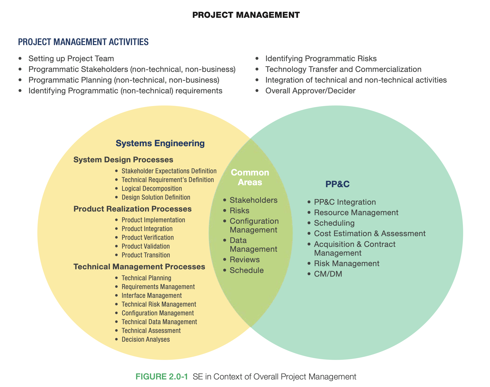

I strongly believe the most valuable skill in the world is understanding complex systems and how they interact with each other.

They are all around us. Forests, thermostat, oceans, economy, internet, and even our galaxy. There are also countless subsystems, for example, a business or a human body. You can break these even further which will result in subsystems of a subsystem.

In engineering, it is the ability to debug, understand feedback loops, and understanding what a good measurement is.

In business, it is the ability to design drive-thru, so customers can purchase goods and services faster and business can maximize efficiency per unit of resource it employs.

In forests, it is the ability to maximize photosynthesis when there is no sun for days.

Or think of a thermostat when it is operating during harsh winters. If a thermostat is constantly fighting to reach equilibrium because the inflow of cold air from outside is higher than the outflow of hot air from HVAC system, it will reach a breaking point.

Everything is a system. The ability to design a complex system and how it interacts with other system is critical to understand. If you can understand the system you operate within, you will know how to drive possible solutions. 

Learning to be a system thinker is highly advantageous. 

> A system is better than a single element and that good design is the overall configuration of a product. — Dieter Rams

> The source of all our problems today comes from the gap between how we think and now nature works. — Dee Hock

> Life is not about control. It’s not about getting. It’s not about having. It’s not about knowing. It’s not even about being. Life is eternal, perpetual becoming, or it is nothing. Becoming is not a thing to be known, commanded, or controlled. It is a magnificent, mysterious odyssey to be experienced. — Dee Hock

> We can’t control systems or figure them out. But we can dance with them! — Donella H. Meadows

> If we’re to understand anything, we have to simplify, which means we have to make boundaries. — Donella H. Meadows

> You think that because you understand “one” that you must therefore understand “two” because one and one make two. But you forget that you must also understand “and.” — Donella H. Meadows

> Remember, always, that everything you know, and everything everyone knows, is only a model. Get your model out there where it can be viewed. Invite others to challenge your assumptions and add their own. — Donella H. Meadows

> There are no separate systems. The world is a continuum. Where to draw a boundary around a system depends on the purpose of the discussion. — Donella H. Meadows

> We can't impose our will on a system. We can listen to what the system tells us, and discover how its properties and our values can work together to bring forth something much better than could ever be produced by our will alone. — Donella H. Meadows

> Let's face it, the universe is messy. It is nonlinear, turbulent, and chaotic. It is dynamic. It spends its time in transient behavior on its way to somewhere else, not in mathematically neat equilibria. It self-organizes and evolves. It creates diversity, not uniformity. That's what makes the world interesting, that's what makes it beautiful, and that's what makes it work. — Donella H. Meadows

> An adaptive agent is constantly playing a game with its environment. What exactly does that mean? Distilled to the essence, what actually has to happen for game-playing agents to survive and prosper? Two things, Holland decided: prediction and feedback. — M. Mitchell Waldrop

> All these complex systems have somehow acquired the ability to bring order and chaos into a special kind of balance. This balance point—often called the edge of chaos—is were the components of a system never quite lock into place, and yet never quite dissolve into turbulence, either. — M. Mitchell Waldrop

## System overview

A system is a set of things—people, cells, molecules, or whatever—interconnected in such a way that they produce their own pattern of behavior over time.

A system is an interconnected set of elements that is coherently organized in a way that achieves something.

A system must consist of three kinds of things: elements, interconnections, and a function or purpose.

A system is more than the sum of its parts. It may exhibit adaptive, dynamic, goal-seeking, self-preserving, and sometimes evolutionary behavior.

A system is composed of stocks (quantities measured at a specific moment in time) and flows (change over time)
A complex system is more than just the sum of its parts.

Feedback loops are where changes in stock affects the flow in/out of the same stock. There can be “balancing” feedback loops that have a regulatory, stabilizing behavior, and “re-enforcing” feedback loops that snowballs into an avalanche in the direction of change (positive or negative).

A diverse system with multiple pathways and redundancies is more stable and less vulnerable to external shock than a uniform system with little diversity.

Stocks are the elements of the system that you can see, feel, count, or measure at any given time. Stocks change over time through the actions of a flow. A stock takes time to change, because flows take time to flow. Changes in stocks set the pace of the dynamics of systems. Time lags that come from slowly changing stocks can cause problems in systems, but they also can be sources of stability. The presence of stocks allows inflows and outflows to be independent of each other and temporarily out of balance with each other.

Systems thinkers see the world as a collection of stocks along with the mechanisms for regulating the levels in the stocks by manipulating flows.

## Characteristics of a system

The following are the key characteristics of a system:

- Resilience: is a major determining factor in a system’s ability to adapt to changing conditions because it is a system’s elasticity, or how well it recovers from a transition. The resilience of any given system is a product of its structure as well as its feedbacks.
- Self-organization: some can also self-organize. That means they can learn, diversify, evolve and build on their own structure.
- Hierarchy: reduce the level of information any given part of the system has to handle. For example, since liver cells know how to decompose toxins, lung cells don’t need to.

## Feedback loop

A feedback loop is a closed chain of causal connections from a stock, through a set of decisions or rules or physical laws or actions that are dependent on the level of the stock, and back again through a flow to change the stock.

There are different kinds of feedback. If a flow stabilizes the difference between the actual and desired levels of stock then it’s known as balancing feedback. There is another kind of feedback loop which is known as reinforcing feedback, which generates more or less of what already exists.

In physical, exponentially growing systems, there must be at least one reinforcing loop driving the growth and at least one balancing loop constraining the growth, because no physical system can grow forever in a finite environment.

The balancing feedback loop that should keep the system state at an acceptable level is overwhelmed by a reinforcing feedback loop heading downhill. The lower the perceived system state, the lower the desired state. The lower the desired state, the less discrepancy, and the less corrective action is taken. The less corrective action, the lower the system state. If this loop is allowed to run unchecked, it can lead to a continuous degradation in the system’s performance.

The more output that is produced, the more can be invested to make new capital. This is a reinforcing loop, like the birth loop for a population. The investment fraction is equivalent to the fertility. The greater the fraction of its output a society invests, the faster its capital stock will grow.

Every balancing feedback loop has its breakdown point, where other loops pull the stock away from its goal more strongly than it can pull back.

## System malfunction

Most of what goes wrong in systems goes wrong because of biased, late, or missing information. Missing information flows is one of the most common causes of system malfunction. Adding or restoring information can be a powerful intervention, usually much easier and cheaper than rebuilding physical infrastructure.

A change in purpose changes a system profoundly, even if every element and interconnection remains the same.

All systems share common features, but some of them can produce extremely unnatural and even problematic behavior. This can happen when the individual subsystems each have a different goal, and it’s called policy resistance. If one actor within a system or any of its subsystems gets the upper hand and uses it to shift the system’s direction, all the others will have to work twice as hard to pull it back in line. The result is a system that looks stuck, reproducing the same problems over and over again. For instance, drug traffickers and addicts both want drug supplies to be high, but police want the opposite.

Stop looking for who’s to blame; instead you’ll start asking, “What’s the system?” The concept of feedback opens up the idea that a system can cause its own behavior.

Hunger, poverty, environmental degradation, economic instability, unemployment, chronic disease, drug addiction, and war, for example, persist in spite of the analytical ability and technical brilliance that have been directed toward eradicating them. No one deliberately creates those problems, no one wants them to persist, but they persist nonetheless. That is because they are intrinsically systems problems—undesirable behaviors characteristic of the system structures that produce them. They will yield only as we reclaim our intuition, stop casting blame, see the system as the source of its own problems, and find the courage and wisdom to restructure it.

Before you disturb the system in any way, watch how it behaves.

## NASA on systems engineering

Aerospace is one of the areas where precision is most needed. It is a combination of the most rigorous science and the most complex engineering. Its work, a spacecraft, must be precise enough to ensure the smooth completion of its mission. 

Since its founding, the National Aeronautics, and Space Administration (NASA) has been dedicated to the advancement of aeronautics and space science. The NASA The scientific and Technical Information (STI) program plays a key part in helping NASA maintain this important role. The handbook provides top-level guidelines for good systems engineering practices; it is not intended in any way to be a directive.

- Systems engineering is a methodical, disciplined approach for the design, realization, technical management, operations, and retirement of a system. A “system” is a construct or collection of different elements that together produce results not obtainable by the elements alone.
- Systems engineering is the art and science of developing an operable system capable of meeting requirements within often opposed constraints. Systems engineering is a holistic, integrative discipline, wherein the contributions of structural engineers, electrical engineers, mechanism designers, power engineers, human factors engineers and many more disciplines are evaluated and balanced, one against another, to produce a coherent whole that is not dominated by the perspective of a single discipline.
- Systems engineering seeks a safe and balanced design in the face of opposing interests and multiple, sometimes conflicting constraints. The systems engineer must develop the skill and instinct for identifying and focusing Efforts on assessments to optimize the overall design and not favor one system/subsystem at the expense of another.
- There are three sets of common technical processes in NPR 7123.1, NASA Systems Engineering Processes and Requirements: system design, product realization, and technical management. 
- The systems engineer will usually play the key role in leading the development of the system architecture, defining and allocating requirements, evaluating design tradeoffs, balancing technical risk between systems, defining and assessing interfaces, providing oversight of verification and validation activities, as well as many other tasks. 
-  In summary, the systems engineer is skilled in the art and science of balancing organizational and technical interactions in complex systems.
- All other products in the system structure are realized by integration. Designers not only develop the design solutions to the products intended to perform the operational functions of the system but also establish requirements for the products and services that enable each operational/mission product in the system structure.
- The first is design. After the entire framework and top-level design are made, it is then realized by engineering methods; at the same time, management is also involved in the process of experimentation. Only in this way can it be ensured that the problems can be adjusted and corrected in time so that they can get back on track as soon as possible.

## Santa Fe Institute (SFI)

Santa Fe Institute is an influential interdisciplinary research institute. The main focus is on complex adaptive system.

Complex adaptive system originated at Santa Fe Institute (SFI). Santa Fe Institute was formed in 1984. The SFI is an independent, nonprofit theoretical research institute dedicated to the study of complex adaptive systems.

Complexity is the science of emergence where many individual agents interact and the outcomes are difficult to predict. A complex adaptive system is a system in which a large network of components with no central control exhibit complex behavior, sophisticated information processing, and adaptive learning.

The theory of complexity manifests itself in “complex adaptive systems,” which are made up of many independent agents who interact and adapt to each other and to their environment, producing the phenomenon of emergence—a system behaving as more than the sum of its parts.

Adaptive agents play game with its environment for fitness. It is feedback driven. Hence, competition is much more essential than consistency. Competition and cooperation may seem antithetical but at some very deep level, they are two sides of the same coin.

Spontaneous self-organization can be found all over nature. It is the most powerful force in biology and living systems operate at the edge of chaos. The characteristics of self-organization are positive feedback, increasing returns, lock-in (harder to change technology until something vastly better comes along), unpredictability and tiny events that have immense consequences all seem to be a re-requisite for life itself.

Everything is caught up in non-linear web of incentives, constraints and connections. The crucial skill is insight. The ability to see connections. Power lies in connections between exploitation (improving current conditions) vs. exploration (taking chances for greater reward).

## Further reading

    
<strong>References</strong>

     

- [Systems Thinking Speech by Dr. Russell Ackoff](https://www.youtube.com/watch?v=EbLh7rZ3rhU)
- [Systems Engineering by NASA](https://www.nasa.gov/wp-content/uploads/2018/09/nasa_systems_engineering_handbook_0.pdf)
- [Thinking in Systems by Donella H. Meadows, Diana Wright](/thinking-in-systems)
- [One from Many by Dee Hock](/one-from-many)
- [Complexity by M. Mitchell Waldrop](/complexity)
- [Santa Fe Institute](https://www.santafe.edu)
- [What is complexity by Farnam Street](https://fs.blog/what-is-complexity/)
- [Loopy, a tool for thinking in systems](https://ncase.me/loopy/)

 