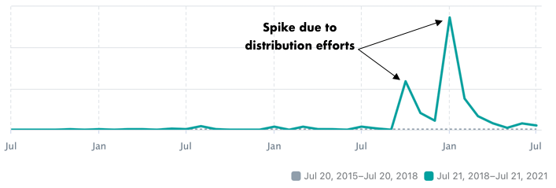

*Creativity* is the most used word around us. But I have struggled to define it. What comes to mind when I think about *creativity* is *constraint*. I find them to be synonymous. A constraint can be due to a lack of resources or imaginations. To get past this hurdle, creativity is required.

I have never really thought of myself as a creative, but I tend to gravitate more towards creatives. I remember as a kid—sitting in my bedroom, flipping pages of a children's book, I was drawn towards words, colors and characters. I admired the visual and literary attributes of characters mentioned in those books. Once I was bored with my old books, I would force my mom to buy new books by crying as loud as I could. Throwing tantrums is what we do as kids, right?

> Creativity is a combination of discipline and a childlike spirit. — Robert Greene

As time passed, I started painting these characters on the wall next to my bed. My room was super organized; toys laid out symmetrically. I don't know where my creativity came from, but it played a large role during my childhood, and it still continues to play a role in my life today.

Creativity is commonly associated with drawing, singing and writing. But it could be any craft. If the foundation of creativity arises from constraint resources then imagination is pushed wider due to limited resources.

The world you and I live in seems to narrow things down to two polar choices—yes/no, democrats/republic, east/west, and so on. But, creativity has no right or wrong answers. You do not need approval or outside validation. Yes, you need feedback on your work, but your opinion is as important as others. You are the ultimate test of whether what you are saying has strength and validity.

1. Creativity gives you space to escape the past and the future. It brings you to the present. 
2. Creativity allows you to come up with solutions to problems.
3. Creativity involves making and building things. And when you make something with your own hands, it will boost your confidence. Creating is playing. Playing is living.
4. Creativity allows you to enter the flow state[0]—a deep meditation. When you are in flow state, it helps you relax. Creative endeavors give you a sense of peace and calm.
5. Creativity allows you to share your work with others. It is easy to feel lost or invincible. Creativity helps you be seen.

> Creativity is not a talent. It is a way of operating. — John Cleese

## Benefits of creative process

Imitation is the process of learning and educational years are mostly imitative. Many of history's greatest artists found their voice by imitating others. In the age of digital revolution, you are fingertips away from finding great work from others.

1. Vincent Van Gogh imitated Jean Francois Millet. [1]
2. Thomas Edison copied Joseph Swan's work. He did not hold the patent for the first light bulb. [2]
3. Apple did not invent the first desktop computer. It copied Xerox. [3]

Imitate before you shoot for originality. Your uniqueness will start emerging over time once you find your voice.

> Nobody tells this to people who are beginners, I wish someone told me. All of us who do creative work, we get into it because we have good taste. But there is this gap. For the first couple years you make stuff, it’s just not that good. It’s trying to be good, it has potential, but it’s not. But your taste, the thing that got you into the game, is still killer. And your taste is why your work disappoints you. A lot of people never get past this phase, they quit. Most people I know who do interesting, creative work went through years of this. We know our work doesn’t have this special thing that we want it to have. We all go through this. And if you are just starting out or you are still in this phase, you got to know its normal and the most important thing you can do is do a lot of work. Put yourself on a deadline so that every week you will finish one story. It is only by going through a volume of work that you will close that gap, and your work will be as good as your ambitions. And I took longer to figure out how to do this than anyone I’ve ever met. It’s going to take a while. It’s normal to take a while. You’ve just gotta fight your way through. — Ira Glass

## Imposter syndrome

Imposter is more common amongst creatives. It is a psychological occurrence in which an individual doubts their skills, talents, or accomplishments and has a persistent internalized fear of being exposed as a fraud. It causes self-doubt and insecurities. The only way to overcome them is to practice and more practice with a right set of daily habits. Little by little, you'll earn your confidence and will let go of your fears of feeling imposter.

> The problem with the world is that the intelligent people are full of doubts, while the stupid ones are full of confidence. – Charles Bukowsk

> Doubt increases with inaction. Clarity reveals itself in momentum. Growth comes from progress. For all these reasons, BEGIN. – Brandon Burchard

> I don’t think there’s an artist of any value who doesn’t doubt what they’re doing. – Francis Ford Coppola

> The greatest creators train not only in their chosen fields, but in the alchemy of fear. – Jonathan Fields

> Schedule daily “white space” in your calendar, where your only task is to think or take a walk and daydream. When you try to generate ideas, shoot for 100 instead of 10. Defer your own judgment and you’ll be surprised at how many ideas you have—and like—by the end of the week. — Reclaim Your Creative Confidence, by Tom Kelley and David Kelley

> When we remove ego, we’re left with what is real. What replaces ego is humility, yes—but rock-hard humility and confidence. Whereas ego is artificial, this type of confidence can hold weight. Ego is stolen. Confidence is earned. – Ryan Holiday

## Originality

Complacency in general disapproves of creativity, but originality is the lifeblood of creativity. Look around you at home, school or work. Complacency is preferred over exploring new ideas. This is often caused due to hierarchical objection from parents, teachers or bosses.

In the digital age, creativity can be misunderstood since consuming and distributing is less challenging. Anyone who is distributing thinks of themselves as creative. Creatives should be careful in understanding this. Originality means going against the grain.

1. Creativity happens in isolation. The presence of others can inhibit your creative process.
2. Creativity happens when you go against the face of reason, authority and common sense.
3. Creativity happens when stitching ideas together from different fields.

> Making unusual connections is the basis of creativity. — Ellen Galinsky

> Creativity isn’t magic: it happens by applying ordinary tools of thought to existing materials. And the soil from which we grow our creations is something we scorn and misunderstand even though it gives us so much — and that’s… copying. — Kirby Ferguson

> The most dramatic results can happen when ideas are combined. By connecting ideas together, creative leaps can be made, producing some of history’s biggest breakthroughs. — Kirby Ferguson

> The aim of art is to ask the big questions. — George Saunders.

> How are we supposed to be living down here? What were we put here to accomplish? What should we value? What is truth, anyway, and how might we recognize it? — George Saunders.

Through practice, your voice should start to emerge. But to be original, the process of creativity requires to ask courageous questions and challenge the status quo by standing up for your own ideas.

## Daily routine

Creativity begs habitual behavior. Why? You often come across people dragging their feet when it comes to working on a task. We are wired to be lazy. For the creative process to flourish, practice daily routine.

Daily routine prevents cognitive load. If you are on an autopilot, you don't have to think twice on how to get started. You simply just get started every day without thinking twice. You have to show up for creativity, you cannot rely on inspiration to show up.

> A genius is born in the midst of boring and repetitive tasks.

Also turn off all the noise. You can’t experience the state of “flow” if you’re constantly being interrupted.

> To be able to concentrate for a considerable time is essential to difficult achievement. — Bertrand Russell

## Breaking the loops

To understand the importance of breaks, we need to understand common loops that cause creative struggle:

1. Learning infinitely but unable to apply.
2. Ideating infinitely but unable to create.
3. Improving infinitely but unable to publish.
4. Thinking infinitely but unable to take action.
5. Working infinitely but unable to play.
6. Comparing infinitely but unable to be inspired.
7. Collecting advice infinitely but unable to decide.

These infinite loops prevent creativity. Understanding these loops is vital. To break these loops, take frequent breaks.

> The only thing that’s going to get you back to work on day two is if you forgive yourself for how bad your work was on day one. — Elizabeth Gilbert

## Generating options
1. Quality comes from quantity. 
2. To get going, start with the easy options. 
3. Create the worst version of your idea. Improve it from there.
4. Start small. Rather than trying to tackle the whole project at once, which can feel overwhelming, try zooming in to an elemental problem.
5. If you’re feeling stuck or not seeing paths forward, set a target number of concepts to generate. 
6. A-B-Q method: Create a version of your idea (A). Then do an iteration of that idea, such as by changing one part of it (B). Then come up with a completely different version of the idea (Q). It should bear no resemblance to “A” or “B”. This is a good technique to find new, uncharted territory to explore. A good technique to get unstuck.
7. Pay attention to when you get into a “flow” and the work just comes, versus when you’re stuck and can’t seem to make progress. Figure out what you can do to get yourself in the right mental state every time you sit down to create.

## Quotes

> Creativity is a different way of looking at things, a different way of looking at ourselves. When we are creative, when we are at play, when we really believe in ourselves, we open ourselves to our own experiences. — George Sheehan

> Thoughts are “designed” just like everything else around us. — Andrea Zittel

> Demands are more oppressive than restrictions. A to-do list is an example of a demand – you become so caught up in the list that you lose the ability to actively prioritize what is most important at any given moment. Restrictions, however, create parameters that limit certain activities in order to allow room for other things that are often hard to find time for (reading, listening to oneself think, crocheting sweaters). In other words, it is better to restrict yourself from doing certain activities than it is to add more things to your to-do list. — Andrea Zittel

> Space can’t be “made”, instead it is denoted by boundaries, divisions, walls, compartments, etc. In essence, space is created by the physical boundaries that we build to contain it. — Andrea Zittel

> I can’t give my students more time in their lives; but what I try to do is change the way they think about and value it in the first place. My class typically includes students who aren’t art majors, some of whom may never have made art before. I give them the same advice every quarter: Leave yourself twice as much time as you think you need for a project, knowing that half of that may not look like “making” anything at all. There is no Soylent version of thought and reflection — creativity is unpredictable, and it simply takes time. — Jenny Odell

> Creativity is contagious. Pass it on. — Albert Einstein

> Creativity is paying attention and putting a light on things we might otherwise overlook. — Wendy MacNaughton

> You can’t use up creativity. The more you use, the more you have. — Maya Angelou

> There is no healthier drug than creativity. ― Nayyirah Waheed

> Creativity keeps the world alive, yet, everyday we are asked to be ashamed of honoring it, wanting to live our lives as artists. i’ve carried the shame of being a ‘creative’ since i came to the planet; have been asked to be something different, more, less my whole life. thank spirit, my wisdom is deeper than my shame, and i listened to who i was. i want to say to all the creatives who have been taught to believe who you are is not enough for this world, taught that a life of art will amount to nothing, know that who we are, and what we do is life. when we create, we are creating the world. remember this, and commit. ― Nayyirah Waheed

> This is the extraordinary thing about creativity: If just you keep your mind resting against the subject in a friendly but persistent way, sooner or later you will get a reward from your unconscious. — John Cleese

> Creativity is just connecting things. When you ask creative people how they did something, they feel a little guilty because they didn’t really do it, they just saw something. It seemed obvious to them after a while. That’s because they were able to connect experiences they’ve had and synthesize new things. And the reason they were able to do that was that they’ve had more experiences or they have thought more about their experiences than other people. Unfortunately, that’s too rare a commodity. A lot of people in our industry haven’t had very diverse experiences. So they don’t have enough dots to connect, and they end up with very linear solutions without a broad perspective on the problem. The broader one’s understanding of the human experience, the better design we will have. — Steve Jobs

> Get off your computer and connect with real life and culture. Life is visceral….Travel as much as you can. It is a humbling and inspiring experience to learn to just how much you don’t know. — John C. Jay.

> Ignore everybody. The more original your idea is, the less good advice other people will be able to give you….You don’t know if your idea is any good the moment it’s created. Neither does anybody else. The most you can hope for is a strong gut feeling that it is….And asking close friends never works quite as well as you hope, either. It’s not that they deliberately want to be unhelpful. It’s just that they don’t know your world one millionth as well as you know your world, no matter how hard they try, no matter how hard you try to explain. — Hugh MacLeod

> Inherently, to live means being creative. Your life is your biggest design project. — Tina Roth Eisenberg

## Art

As far as I can remember, I enjoyed everything about art and the people who make it—artists. In elementary school, I enjoyed crayons and a sketchbook. I was never good. Yet, making something with pen and paper made me forget real-world problems. An underlying reason which I found art very therapeutic at an early age.

Things got in the way so I abandoned my crayons and sketchpad.

In college during my final quarter, I took some creative classes. I didn't need the GPA boost, but I was missing some credits before I could graduate. This forced me to enjoy classes and not worry about grades. Or finding extra motivation to study for exams. One was _Music Theory 101_ and the other one was _Art 101_. I don't remember much about music theory, but I do remember things I drew, painted and sketched in my art class. To this day (after 8 years), I go over my sketchpad that I used during the class.

Covid hit in 2020 and I picked up on making art again after work and during the weekends. I realized how therapeutic drawing was. I forgot about everything that was going around me. I came to a realization that getting lost in making and creating art was therapeutic. Everyone should find hobbies because they inspire us to tap into our creative side. Making art is like meditating with a pen which requires no typing or browsing endlessly on devices. It requires singular focus. Below are some of the sketches from 2020 quarantining.

 

Art is contextual. It depends on conditions such as emotions, interests, perspectives and global issues. Art uncovers stigma, truth and propaganda. It is inspiring and moving. There is something else about making art which is getting lost in the process and letting our imaginations play out. It is an iterative process which never stops. To say the least, work of an artist is never completed, only abandoned.

I have emulated my sketches from contemporary artists such as Oliver Jeffers and Jean Julian. Though, I am obsessed with Oliver Jeffers. His work takes me back to childhood which I can't explain why. His work is poetic in some sense which addresses ongoing issues of the world. His illustrations and stories are fundamental that both a kid or an adult can understand. Curiosity and humor are underlying themes of his work which I am drawn to in real life.

> If art is to nourish the roots of our culture, society must set the artist free to follow his vision wherever it takes him. We must never forget that art is not a form of propaganda; it is a form of truth. — JFK

> If you hear a voice within you say 'you cannot paint,' then by all means paint, and that voice will be silenced. — Vincent Van Gogh

## On indie hacking

Indie hacking is a perfect way to explore creativity. I am fascinated by the idea of indie hacking for several reasons. First, it minimizes startup risk which allows you to bootstrap and start small. Second, it allows you to keep your job. I like the idea of having a job because it is less lonely. Third, it allows you to learn new skills. It is a good substitute for business school. Being an indie hacker taught me several lessons and help me acquired new skills while exploring my own creative itch.

In 2018, I came across an idea of starting a fun project called Wise Charlie. By this time, I had plenty of experience from working at a small and large startup. I learned a lot of great things, but I also picked up on a lot of silly things. For example, what if someone steals my idea? Or what if I raise capital? Or what if I find a co-founder? The list of questions that provides little to no value goes on and on.

However, I was determined to build something for the sake of creating something useful and learn something new.

I decided to be an indie hacker. It means many things to many people, but to me it meant only one thing—being independent. I would not be held by anyone on making project decisions. It was all about freedom-seeking project and I'd be in charge of making money however I want. There is no revenue or user acquisition target. There was only one goal—continuity over a long period of time.

If something didn't work, I would iterate, and find an alternative solution until someone is willing to pay me for something valuable I have created. Four years later, I have ~500 customers. You must be wondering, what is wrong with him? It took him 4 years to acquire 500 customers in hyper growth environment.  But you don't understand what I just said, the objective is not growth, but continuity over long period of time. 

There are many times I felt like giving up because I wasn't motivated, but the project survived because I took breaks whenever I wanted. If I had associated any success metric, I'd bet the project would've died long time ago. If I have brought on a co-founder, I would've had run into conflict management. I avoided everything that was in the way of creating.

So, what is indie hacking? It is building a project on your own terms. The sole objective is the continuity of the project and iterate over it until you have a paying customer.

With this experience, I'd like to share some of the things that matter when thinking about becoming an indie hacker.

1. **Start something**
Wise Charlie project was a derivative of *Poor Charlie's Almanack: The Wit and Wisdom of Charles T. Munger*. I love reading and this book is highly recommended by many people. Charlie Munger is one of the best intellectual of our century. I wanted to take his ideas and make them digestible especially for parents and young adults. This was a hypothesis that I landed on. I ran this idea by people in my inner circle. I followed my intuition once I understood the problem I wanted to solve. 

Ideas are everywhere. Cast your net wide enough for ideas and pick one that you feel strongly about. The enemy of greatness is not getting started. Perfection is an asymptote that you don’t want to chase. I could've done more market research, more user-testing, and more on and on, but it would've led me to overthink. Pick a problem and run with it. Your ability to innovate is correlated with your ability to pick an idea and iterate over it a thousand times.

> I must CREATE a system or be ENSLAVED by another means; I will not reason and compare; my business is to CREATE. — William Blake

2. **Build your true fans**
In my previous startup experience, I didn't treat my customers as fans. I treated them like just another data point. A decade ago, Wired editor Kevin Kelly wrote an essay called *1,000 True Fans*. I highly recommend reading this piece. Kevin Kelly was absolutely on the right side of the coin in his prediction of creators leveraging on online platforms. I have come across so many creators who have adopted 1000 true fans mentality. Kevin Kelly argues that embracing true fans can help creators earn $100,000 ($100/user * 1000 users). I am nowhere near those earnings, but I have acquired meaningful relationships with my 1000 true fans. Treating customers like fans forces you to engage with them.

I made a strategic goal of acquiring 1000 true fans through newsletter, social media and/or sales. My thesis was my early adopters would go bat for me if I supported and took care of my fans. They sure did. Zak T, my good friend learned about mental models was the first customer. We are still in touch and talk occasionally about the project. Reciprocity works only when you give others. Be kind to others and offer an extra mile of help. Your fans will remember that. I have several customers who I frequently talk to. Being an indie hacker has re-kindled old relationships and built new friendships. Focus on finding your true fans. They are everywhere on the Internet.

> No one has ever become poor by giving. — Anne Fran

3. **It takes time**
It takes a very long time to find something that works. My sales were flat for two years. And then it took off! Progress happens slowly then all at once. I was responsible for that flat line because after building the product and website, I abandoned the project. I picked up on Wise Charlie in 2020 back again. I redesigned the landing page, made it much precise and called out call-to-action items. Making things simpler made a huge difference because visitors have a very short attention span. Tell them in 10 seconds otherwise you have lost them.

I also started spending more time on distributing and cold emails. My sales grew, social media accounts grew and newsletter grew. But all-in-all, the spike in the chart below is directly correlated with my distribution efforts. My efforts are still inconsistent, but one thing is clear, efforts lead to action. Building anything valuable takes time, effort and energy. Don't skip distribution.

4. **Opportunity cost**
I have a development background so I was obsessed with building features from scratch. I spent time developing the first version of the website using HTML, CSS and Vue.js. As my features got complex, I wasted more time on managing code rather than building and distribution.

After a while, I let go of the code and starting leveraging on no-code tools. Yes, it cost me $200 per year, but now I use that time on writing blog, content distribution and sales. I am nimble on spending my resources, both time and money. But now I always ask, what is the opportunity cost if I do X? Asking this question helped me prioritize. I was spending more time on managing pixels and layout of the website than focusing on finding Wise Charlie fans. Outsource your least impactful tasks by leveraging on tools available.

5. **Feeling like an imposter**
There is always someone who is doing better than you are. Trying to become someone else and replicate their outcome is something you don't want to chase. It will lead to imposter syndrome. It is common to be envious of other people's success. But rather celebrate their success and learn from them.

I have gone down the rabbit hole of feeling uneasy because my accomplishments are not good enough when compared against other projects. But now I look at it from a different lens which is the continuity of the project. The only metric that matters.

To summarize, being an indie hacker gives you autonomy, sharpen your skills, and teach you valuable lessons about building and shipping products. Being an indie hacker is not about starting a business but a journey to experience building a product you have full control over. You end up sharpening your technical skills, marketing chops, product design, and documentation habits.

## Further reading

    
<strong>References</strong>

     

- [0] [Flow](https://en.wikipedia.org/wiki/Flow_(psychology))
- [1] [Copying Millet](https://www.vangoghmuseum.nl/en/stories/van-gogh-and-millet#2)
- [2] [Did Thomas Edison steal the idea for electric light globes?](https://www.ipaustralia.gov.au/sites/default/files/education/worksheet_3-_who_was_joseph_swan.pdf?acsf_files_redirect)
- [3] [Xerox Alto](https://en.wikipedia.org/wiki/Xerox_Alto)
- [Isaac Asimov Asks, “How Do People Get New Ideas?”](https://www.technologyreview.com/2014/10/20/169899/isaac-asimov-asks-how-do-people-get-new-ideas/)
- [The Inner Ring of the Internet](https://every.to/divinations/the-inner-ring-of-the-internet)
- [Tim Ferris with Jerry Seinfeld](https://tim.blog/2020/12/09/jerry-seinfeld-transcript/)
- [Do schools kill creativity? | Sir Ken Robinson](https://www.youtube.com/watch?v=iG9CE55wbtY&list=FLrlPaGQuKQiYMqpFYyc-40A&index=42)
- [Neil Gaiman - Inspirational Commencement Speech at the University of the Arts 2012](https://www.youtube.com/watch?v=ikAb-NYkseI&list=FLrlPaGQuKQiYMqpFYyc-40A&index=4)
- [Questions to Ask Yourself Before Starting](https://www.indiehackers.com/post/questions-to-ask-yourself-before-starting-9813f617b3)
- [1000 True Fans by Kevin Kelly](https://kk.org/thetechnium/1000-true-fans/)

 
