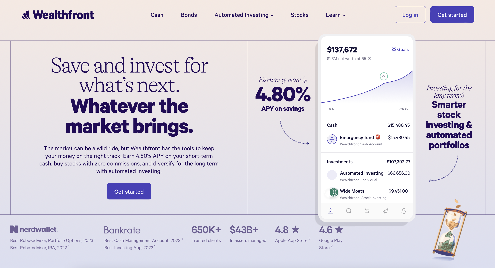

The trick to a product teardown is deep empathy for the end user. UX and product management share the same broad goals: understanding users’ needs and solving their core problems with excellent user experience. The emphasis is on solving the user problem. Don't let—product that looks great, has nice onboarding, and delightful animations—be a distraction.

Some questions to ask when doing a product teardown:
- What is the offering?
- What is the founder/organization story? What is their mission? What is the motivation for people behind the product?
- What problem does this product solve? Is this really a problem? Is it an underlying problem or a surface level problem? How painful is this problem for users?
- Are there any metrics on number of users?
- What is the goal or a strategy and does this product help solve or make progress on it?
- Where are the points of friction? What is clear and what is not clear?
- How much customization affordance does a product offer to its clients? 
- What are the most competent competitors to this product?
- How does this compare to using an alternative solution? Do you really need this?
- Are there any design patterns or user experience that standout?
- Do they have unique organizational structure to empower product, design and engineering to solve user problems? What is their team culture?
- How does the product grow? Are there any unique growth strategies?

Product teardown is an exercise to gain expertise from strong teams who are building great products. Hands-on experience beats any book or lecture in gaining a deep understanding of how to build great products.

| Product | Description | 
| -------------|:-------------:|
| _Wealthfront_| A robo-advisor service that recommends a low-cost, tax-efficient diversified portfolio that match your financial goals and risk tolerance. |
| _Ramp_ | They provide corporate cards and a spend management platform, helping startups save money and control spending. |
| _Duolingo_ | They use gamification approach to language learning, with lessons that incorporate translating, interactive exercises, quizzes, and stories to make learning more engaging and fun. |

    
<strong>Wealthfront</strong>

     

 

Wealthfront is an automated investment offering based in Palo Alto, California. It is a goal-based planning software with multiple goals, wealth-planning tool and other offerings.

After a successful career as the co-founder of VC firm Benchmark Capital, Andy Rachleff started Wealthfront with Dan Carroll in 2008. Andy also teaches entreprenuership at Standford.

Wealthfront levels the playing field. Because everyone deserves an equal chance to succeed. At Stanford, entrepreneurs and students alike came to Andy Rachleff for investing advice. But he often couldn’t recommend the services he used because the minimums were too high, especially for students. He saw a need to democratize access to sophisticated investment products. While Dan Carroll learned financial advisors make 90% of their revenue from the top 20% of their clients. This was during 2008 recession. People like his parents didn’t get the attention they deserved that they paid for. Dan started tinkering with a few solutions. He eventually built a prototype that got some traction, and got the attention of Andy from Stanford.

As of March 2023, Wealthfront has $43+ billion in AUM and 650k+ clients.

Wealthfront focuses on 3 controllable factors—lower taxes (tax-loss harvesting), reduced costs (flat charge 0.25% annual fee and low-cost index funds) and risk management (diversification) through automated investing software.

- Takeaways:
    - $500 for investment accounts; $1 for cash management accounts; $1 for stock accounts. Making minimum this low makes the offering accessible especially for younger generation who doesn't have much to invest. This is a great way to ride along wealth accumulation as the wealth accumulates for entry level investors. 
    - Fees 0.25 percent of assets annually and average of 0.08 percent for core portfolio.
    Account types supported: Independent and joint taxable, Roth IRA, traditional IRA, SEP IRA, rollover IRA, trusts, 529s.
    - Automatic rebalance without any minimum.
    - Wealthfront has done an excellent job with educational material and calculators including transparency on pricing. This is critical for a financial product because the industry has kept costs hidden for a long time breaching client trust. It has calculator which shows how much fees would be paid for every $10k. They also have risk slider and portfolio breakdown for each one of the risk categories. This is useful because I can explore before I can create an account. More here [investing strategy guide](https://www.wealthfront.com/investing-guide#our-strategy).
    - Besides the core robo-advsior offering, Wealthfront offers yield products via cash and bond portfolio. Both have competitive yields. 
    - It also has Stock Investing offering with fractional shares. It has stock collection which is based on theme. If you want to invest in Artificial Intelligence, you can pick AI basket. The in-app experience also recommends stocks that are not as popular making research and discoverability easier. Lastly, you can fund once and split into more than 1 stock.
    - Wealthfront also offers cryptocurrencies.
    - Overall it has welcoming branding and copy. A great example of copy for their bond portfolio—“Not too hot. Not too cold. It’s like the Goldilocks of risk.”

- Reading material:
    - [Investing Strategy Guide](https://www.wealthfront.com/investing-guide#our-strategy)
    - [Investment Methodology](https://www.wealthfront.com/methodology)
    - [Stock Investing](https://www.wealthfront.com/stock-investing)
    - [Retirement Investing](https://www.wealthfront.com/retirement)
    - [Socially Responsible Investing](https://www.wealthfront.com/socially-responsible-investing)
    - [Financial Planning](https://www.wealthfront.com/planning)
    - [Performance Calculator](https://www.wealthfront.com/historical-performance)
    - [Engineering Blog](https://www.wealthfront.com/engineering)
    - [Career Guide by Andy Rachleff 2013](https://cdn.wealthfront.com/public.email.images/2013_Silicon_Valley_Career_Guide.pdf)
    - [Building Wealthfront’s Multi-Platform Design System](https://eng.wealthfront.com/2022/05/10/building-wealthfronts-multi-platform-design-system/)
    - [Optimizing Multi-table SQL Queries for Wealthfront’s Trading System](https://eng.wealthfront.com/2023/05/31/optimizing-multi-table-sql-queries/)
    - [Onboarding Flow](https://uxarchive.com/flow/wealthfront/app-4f17cce6b7ada1ff/onboarding/appflow-5ec216be72674fdb)

 

    
<strong>Ramp</strong>

     

 

Ramp is a cloud based finance automation platform designed to save time and money for all size companies. Ramp's core products are corporate card and spend-management platform which tracks down real-time spending. This helps identify areas where costs can get out of hand. It helps management be proactive to cut costs in areas that are unproductive to any organization. Customers love how intuitive the products are. It is New York's fastest growing SaaS startup today (2023). 

Ramp continues to innovate in the space. They also launched Bill Pay which is a software capable of scanning invoices and using AI to automate bill-payment workflows. Another new feature called Flex mimics the structure of buy now, pay later and gives businesses a low-cost way to spread out vendor payments.

Velocity is their strategy. They continue to build at a rapid rate and helping companies streamline expense management. Ramp has done an excellent job of removing barriers for prospects to explore product demo. It has the best product tour I have come across.

Another delightful experience was the library of free tools.

- Takeaways:
    - Speed (velocity) is competitive advantage.
    - Customer support reports into product.
    - Product, design and engineering reports to the CTO.
    - Teams are organized around business outcomes.
    - No stand-ups, daily updates are asynchronous.
    - Keep teams small.
    - Let teams decide for themselves what tools to use that maximize productivity.
    - To win in the market, you need to be product-strategy-driven, not sales- or marketing-driven.
    - Bottoms up product strategy:
        - Goal → What do you want to see in the world?
        - Hypothesis → Why do you think this will work?
        - Right to Win → Why are we uniquely positioned to do this?
        - Metric → How will you measure that it does?
        - Initiatives → What do we need to do to reach the goal?
        - Risks → Why would we fail & what should we do about it?
        - Long Term Outcomes → How will this work compound?
    - Product roadmap needs to be aligned with marketing.
    - OKRs should not be used for performance management otherwise they feel forced.
    - Everyone is invited to give to opinion on product enhancements.
    - Everything at Ramp is publicly available. Teams are required to publish openly, with high clarity and high succinctness, their goals, progress, and targets.
    - Simplify: It is significantly harder to build a complex product that is simple at the surface for our users. We sweat every pixel and cut complexity until all our customers, from small mom-and-pop shops to multinational companies, can intuitively understand how to successfully use Ramp. Why have two clicks when you need one? Better yet, no clicks. The less time you spend on Ramp, the better. 
    - Taking the bets with asymmetric upside. If an outcome is exponential, take the bet.

- Reading material:
    - [Ramp](https://ramp.com)
    - [Ramp Story](https://ramp.com/blog/ramp-raises-115m-from-stripe-and-d1-to-become-nys-fastest-growing-startup-ever)
    - [Lenny's Newsletter | How Ramp builds product](https://www.lennysnewsletter.com/p/how-ramp-builds-product)
    - [Lenny's Newsletter | Velocity over everything Ramp](https://www.lennysnewsletter.com/p/velocity-over-everything-how-ramp)
    - [ACH File Overview](https://achdevguide.nacha.org/ach-file-overview#:~:text=An%20ACH%20file%20is%20a,must%20follow%20a%20specific%20order.)

 

    
<strong>Duolingo</strong>

     

 

Founded in 2011 by Luis von Ahn and Severin Hacker, the company is now (2023) valued at $6.0B. It is the most downloaded education app. Duolingo motivates users to do tasks that’s difficult, time-intensive, and mentally taxing, all while convincing them to come back tomorrow and do it all again. It is a free app for language learning via spaced repetition technique.

> We created Duolingo in 2011 with a mission to develop the best education in the world and make it universally available. I’ve always felt that economic inequality is one of the biggest problems facing humanity, and education is the best way to help most people around the world improve their lives. Our vision is to create a world where more money can’t buy you a better education. — Luis von Ahn

Gamification strategy is at the core of Duolingo. With bite-sized lessons, badges, leveling, leaderboards, sound, nudges etc., Duolingo has gamified learning. The app does a great job with reducing complexity for the user in decision-making, so they can stay focused on learning new languages. The job-to-be-done—help user learn a new language.

Based on recent [quarterly filings](https://investors.duolingo.com/static-files/706ad636-7e3f-4430-adc1-16bf0411f3d9) Duolingo has 70 million active learners.

- Takeaways: 
    - _Branding_: They established a deep relationship like student-teacher between the user and the mascot—Duo. This is a strong recognition of their brand. Duo has a lot of character and pops up throughout the workflows.
    - _Landing page_: The most surprising part of the landing page is how clear and simple it is. There is almost no friction with several CTAs or content.
    - _Gamification_: The use of gamification to increase user engagement which can be valuable especially when learning something new requires heavy load on cognition.
        - The use of simple goals, gamification, and rewards are positive reinforcements to improve retention.
        - The use of simple goals, gamification, and rewards are positive reinforcements to improve retention.
        - The use of streaks (loss aversion): “You haven’t learned anything new this week.” 
        - The use of competition (extrinsic motivation): Duolingo strikes a nice balance because it can be a double-edged sword. Those who aren’t interested in the competitive aspect are put into “easier” leagues. “Hardcore” players are removed from the easy leagues and bracketed to compete against themselves.
        - The use of encouragement (emotional safety): “Nobody likes making a mistake.” “Nobody likes feeling like an idiot.” Messages like these seem small, but they can really bring a smile to your users.
        - The use of progress to show the user how many steps it might take for them to complete.
    - _User sign-ups & onboarding_:
        - Duolingo excels in taking a user to the core product as soon as possible. This is critical in showing value in short amount of time.
        - “The free, fun, and effective way to learn a language!”. A clear Call-To-Action (CTA) makes it easy for users to move forward.
        - One of the things that set Duolingo apart from other language-learning apps is its attention to detail when it comes to copywriting. Users are greeted with cheerful messages like “Let’s do this!” or “Time to get your language on!” or “Let's get the party started!” or “15 minutes a day can teach you a language. What can 15 minutes of social media do?”
        - Users are empowered to make quick decision without being overwhelmed with too many options.
    - _Growth tactics_: Duolingo has great tactics in place for retention and engagement:
        - An overlay over the rest of the screen to keep users focused on the CTA. This allows users to focus on one action, so other options aren't competing for the user's attention.
        - Nudging users to leave after they completed their Daily Goal. Allow users to disengage from your product with a sense of completion and offer them to return to its app preventing them from feeling overwhelmed.
        - Using retention techniques across all channels—emails and phone notifications.
        - Other tactics include rewards and streaks.
        - Offering simplified experiences all across its application workflow. This ultimately helps with activation rate and user retention.
    - _Team structure & planning_: All of Product Management, Product Ops, and UX Research are part of Duolingo’s larger Product organization which reports to VP of Product.
        - While teams are metrics-driven, product teams are structured as either (1) metric-based or (2) feature-based. 
            - Metric-based teams are structured around clear metrics that impact something the company wants to improve, like revenue or DAUs. 
            - Feature-based teams are defined by the product problem we want to solve, and in most cases there isn’t a good metric that can accurately quantify success.
        - There are two main planning cycles: quarterly OKRs for all teams/areas and yearly OKRs for the whole company.

- Reading material:
    - [Duolingo](https://duolingo.com)
    - [Lenny's Newsletter | How Duolingo build products](https://www.lennysnewsletter.com/p/how-duolingo-builds-product)
    - [Lenny's Newsletter | How Duolingo reignited growth](https://www.lennysnewsletter.com/p/how-duolingo-reignited-user-growth)
    - [Lenny's Newsletter | Nickey Skarstad Interview](https://www.lennysnewsletter.com/p/nickey-skarstad-airbnb-etsy-shopify#details)
    - [Research Blog](https://research.duolingo.com/)
    - [Duolingo Blog](https://blog.duolingo.com/)
    - [Growth Model Duolingo](https://blog.duolingo.com/growth-model-duolingo/)
    - [Experiment at Duolingo](https://blog.duolingo.com/improving-duolingo-one-experiment-at-a-time/)

 